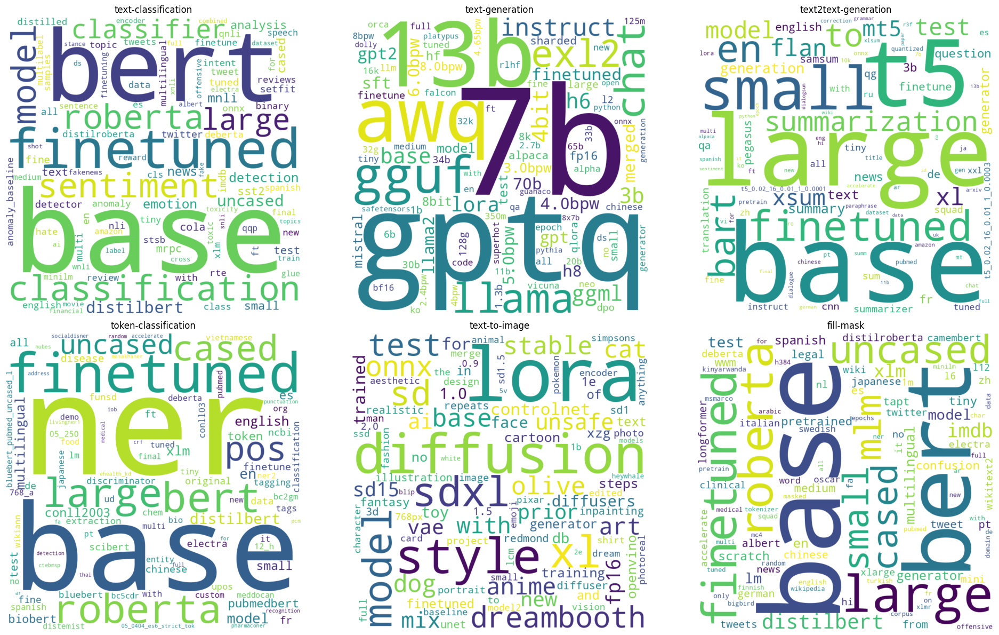
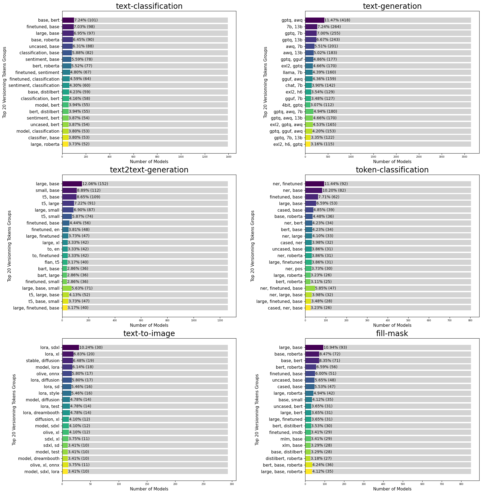

# Are Datascientists Embracing DevOps Principles for Model Versioning?

## Auteurs

Nous sommes quatre étudiants en dernière année à Polytech Nice-Sophia spécialisés en Architecture Logicielle (AL) :
- _Badr AL ACHKAR_
- _Nadim BEN AISSA_
- _Sourour GAZZEH_
- _Imene YAHIAOUI_

## I. Contexte

L'évolution constante des principes de DevOps vers le domaine de l'apprentissage automatique soulève la question cruciale de l'adoption de ces principes par les data scientists pour le versionnement des modèles. Cette intersection entre ingénierie logicielle et apprentissage automatique constitue une zone d'intérêt particulier, motivée par notre quête de comprendre comment ces deux domaines interconnectés convergent.

Notre motivation derrière cette étude réside dans la volonté de démystifier les pratiques actuelles du versionnement des modèles par les data scientists. Comprendre comment ces professionnels gèrent les différentes versions de leurs modèles revêt une importance capitale dans un contexte où l'apprentissage automatique s'insère de plus en plus dans des pipelines de développement logiciel.

- ### Outils de Versionnement Identifiés :

Dans cette recherche, deux outils majeurs ont capté notre attention : MLflow et Hugging Face. MLflow, au centre de l'écosystème DevOps pour le machine learning, propose une approche intégrée du cycle de vie des modèles. En parallèle, Hugging Face, en tant que plateforme publique, offre une alternative en mettant à disposition des modèles issus de grandes entreprises.

#### 1. Exploration de MLflow : 

MLflow révolutionne la gestion des modèles d'apprentissage automatique
en unifiant le processus du développement à la production. La première
phase de notre enquête se concentre sur la manière dont MLflow gère les
versions des modèles.

- **Comment MLflow stocke les modèles ? Comment sont-ils enregistrés, organisés et récupérés ?**

Pour répondre à ces questions cruciales, nous avons consulté la documentation officielle de MLflow et nous nous sommes appuyés sur les résultats validés par plusieurs articles scientifiques, dont les références sont soigneusement documentées dans notre bibliographie.

MLflow enregistre les modèles sous forme d'artefacts, utilisant divers
formats appelés "flavors", qui correspondent à différents formats
spécifiques de bibliothèques de machine learning, tels que TensorFlow,
PyTorch, Scikit-Learn. Ces modèles sont organisés dans un "registre"
structuré, chacun possédant un nom unique, des versions, des étapes de
transition (telles que développement, production, archivage) et
d'autres métadonnées.

La gestion des versions en Mlflow est automatisée, où chaque modèle
enregistré peut avoir une ou plusieurs versions. Lorsqu'un nouveau
modèle est ajouté au registre des modèles, il est enregistré en tant que
version 1. Chaque nouvel enregistrement sous le même nom incrémente
automatiquement le numéro de version.

Il est possible d'adapter manuellement cette gestion de versions à
travers l'utilisation d'alias, de tags et de descriptions :

- Les **_alias_** permettent de pointer vers une version spécifique du
  modèle, facilitant ainsi le référencement via l'URI
  models:/<model-name>@<alias>. Ils offrent une référence
  mutable et nommée à des versions spécifiques, simplifiant leur
  déploiement.
- Les **_tags_** permettent de catégoriser les modèles selon leur fonction
  ou statut.
- Les **_annotations_** et **_descriptions_** en Markdown fournissent des
  informations cruciales telles que des descriptions de version, des
  ensembles de données utilisés, etc.

Cependant, au cours de notre exploration des modèles et du processus de versionnement, nous avons constaté que MLflow est principalement adopté par des entreprises, et aucune d'entre elles ne rend publics leurs modèles, entravant ainsi notre accès à des projets et modèles versionnés pour une analyse approfondie.

#### 2. Exploration de Hugging Face :

Hugging Face se positionne comme une plateforme clé pour le partage et la découverte de modèles d'apprentissage automatique. Elle constitue une plateforme de choix pour des data scientists et des entreprises de renom telles que Meta et Google, qui y partagent leurs travaux avec la communauté internationale. À la date de rédaction de cet article, le 1er février 2024, Hugging Face héberge 490,621 modèles, accessibles publiquement, ce qui a joué un rôle déterminant dans le choix de cette plateforme pour notre recherche.

Notre recherche s'est concentrée sur la façon dont les modèles et leurs versions sont nommés et gérés sur Hugging Face. Selon sa documentation officielle, la plateforme offre une grande flexibilité aux data scientists pour le nommage de leurs modèles, facilitant ainsi leur identification et leur gestion.

## II. Question général
L'objectif fondamental de notre projet de recherche est d'explorer l'adoption des principes DevOps par les data scientists pour le versionnement des modèles.

Ces réflexions nous conduiront à explorer les questions sous-jacentes suivantes :

1.  **_Est ce que les modèles publiés sur Hugging Face adoptent un
    schéma de versionnement traditionnel ou part plutôt sur le
    versionnement libre ?_**

2.  **_Le type de tâches (image-to-text, reinforcement, etc.)
    influence-t-il le schéma de versionnement ?_**

3.  **_Existe-t-il des tendances de versionnement spécifiques dans les grandes entreprises utilisant Hugging Face?_**

## III. Collecte de Données : Méthodes et Outils

Hugging Face abrite une vaste collection de plus de 400 000 modèles. Notre recherche a adopté une approche sélective en mettant en avant les modèles dotés de tags. Cette stratégie ciblée s'est avérée efficace pour extraire les modèles les plus significatifs, étant donné la diversité des modèles disponibles sur la plateforme Hugging Face. De plus, nous avons veillé à éviter les doublons de modèles, assurant ainsi la validité et la fiabilité de notre échantillon.
Pour ce faire, nous avons utilisé la technique de web scraping, en exploitant le langage de programmation Python et en faisant appel à des bibliothèques spécialisées telles que BeautifulSoup pour analyser le HTML et requests pour gérer les requêtes HTTP. 
Cette démarche  a conduit à la création d'une base de données riche, comprenant environ 230 000 modèles, qui constitue une ressource adéquate et pertinente pour répondre aux questions de notre étude de recherche.

## IV. Hypothèses, Expériences & Analyse des résultats

1. **_Adoption du Versionnement Traditionnel vs Versionnement Libre des
    Modèles_**

**1.1. _Hypothèse : Le versionnement des modèles ne suit pas une
approche traditionnel - (major,minor,patch)_**

L'analyse des modèles sur Hugging Face révèle une particularité dans leur numérotation de version, qui semble s'écarter des schémas classiques de versionnement. Typiquement, le versionnement conventionnel suit un modèle sémantique structuré, basé sur trois niveaux de changement : majeur, mineur et correctif, indiqués respectivement par les chiffres dans le format version majeure.minor.patch (par exemple, 1.2.3).  
Néanmoins, notre observation des modèles sur Hugging Face a révélé des séquences variées et moins formalisées avec termes spécifiques tels que GPTQ, AWQ, GGUF, GGUML, 3b, 7b, 13b, small, medium, large, base, finetuned, etc.
Ces constatations indiquent un écart potentiel par rapport au cadre de versionnement traditionnel. Cette observation soulève une interrogation cruciale pour notre recherche : les modèles sur Hugging Face suivent-ils un schéma de versionnement traditionnel ou adoptent-ils plutôt une approche de versionnement plus libre et moins structurée ? 

**1.2. _Expérience : Calcul de l'adoption du versionnement traditionnel_**

Nous avons exploité la base des modèles téléchargés grâce au web scraping, en nous focalisant exclusivement sur l'analyse du nom de l'artefact, qui renferme des informations cruciales telles que la version du modèle. Afin de discerner le versionnement sémantique au sein de ces noms, nous avons opté pour un format spécifique basé sur des motifs fréquemment rencontrés : (vX, vX.X, vX-X, vX.X.X, etc.).

Notre objectif était de calculer le pourcentage de modèles adoptant une approche de versionnement sémantique parmi l'échantillon analysé. 

Les résultats ont été graphiquement représentés sous la forme d'un diagramme circulaire, offrant une perspective visuelle sur la prévalence des modèles avec versionnement par rapport à ceux sans versionnement apparent.

**1.3. _Résultat :_**

Le graphique ci-dessous présente les résultats de l'expérience, illustrant le pourcentage d'adoption du versionnement sémantique :

Cette première expérience nous a permis de confirmer notre hypothèse, avec un ratio de 79% des modèles qui ne suivent pas le versionnement traditionnel.

Cependant, il est essentiel de souligner qu'au sein de ces modèles, environ 21% (soit environ 41 000 modèles) semblent explorer des tentatives de versionnement sémantique. Ce nombre important souligne l'intérêt marqué de certains datascientists à établir une structure plus claire et compréhensible pour leurs modèles. Cette observation met en lumière la diversité des pratiques de versionnement au sein de la communauté des datascientists, reflétant peut-être des besoins spécifiques liés à la nature expérimentale de certains projets ou à des préférences individuelles.

Cette variabilité dans les schémas de versionnement peut être, en partie, attribuée à la flexibilité offerte par les plateformes de partage de modèles, telles que Hugging Face, qui permettent aux data scientists de définir leurs propres conventions de versionnement.

2.  **_Influence de la tâche du modèle sur son versionnement_**

  **2.1. _Hypothèse :  La nature de la tâche du modèle influence la  façon avec laquelle on le versionne_**

Nous émettons l'hypothèse selon laquelle la nature de la catégorie d'un modèle influence de manière significative sa méthodologie de versionnement. Cette hypothèse suggère que des caractéristiques propres à chaque catégorie de modèle peuvent exercer une influence sur les choix de versionnement adoptés.

  **2.2. _Expériences realisées_ :**

Dans le cadre de notre étude sur l'influence de la tâche des modèles sur leur versionnement, nous avons réalisé deux étapes distinctes. Dans la première étape, nous avons cherché à identifier les types de tâches pour lesquels les modèles adoptent un versionnement sémantique. Dans la deuxième étape, nous avons exploré l'existence de patterns de versionnement libre, le cas échéant.

a. **_Etape 1 : Analyse du Versionnement des Modèles par Catégorie de Tâche_**

Dans cette phase, nous avons reproduit la méthodologie de la première expérience pour identifier les modèles adoptant des pratiques de versionnement standard, classés par catégorie. En réutilisant les différents modèles, nous les avons subdivisés en catégories, générant ainsi des graphiques en dispersion illustrant l'adoption du versionnement sémantique par catégorie de modèles. Ces graphiques tiennent compte du nombre de modèles par catégorie et du pourcentage d'adoption du versionnement sémantique, explorant ainsi les tendances et motifs récurrents dans les pratiques de versionnement. Cela met en lumière l'influence potentielle de la tâche des modèles sur ces choix.

- **_Résultat_**

Les résultats graphiques ont clairement démontré que le pourcentage d'adoption du versionnement sémantique varie considérablement d'une catégorie de modèle à une autre :

- **_Analyse des résultats_**

Cette observation souligne une corrélation directe entre la nature spécifique de la tâche d'un modèle et les choix de versionnement qui lui sont associés. Les différentes catégories de modèles présentent des tendances distinctes en matière de versionnement, révélant une diversité d'approches au sein de la plateforme. Notre jeu de données est constitué de 42 catégories, et selon le schéma, certaines sont plus volumineuses que d'autres. Quelques catégories massives se distinguent par un taux d'adoption du versionnement sémantique élevé, principalement "Reinforcement Learning" avec un pourcentage de 68.80% et "Automatic Speech Recognition" avec un pourcentage de 46.55%.
Ces catégories spécifiques semblent favoriser l'utilisation d'un modèle de gestion des versions sémantique.
En revanche, le reste des catégories affiche majoritairement un taux d'adoption inférieur à 20%.

En effet, le domaine du "Reinforcement Learning" se caractérise par des modèles d'apprentissage automatique qui interagissent dynamiquement avec leur environnement. Dans ce contexte, les modèles apprennent en prenant des décisions successives afin de maximiser une récompense cumulative. Cette approche d'apprentissage continu est particulièrement adaptée à des environnements complexes et dynamiques, où les modèles doivent s'ajuster constamment pour relever des défis émergents. Les modèles de "Reinforcement Learning" se distinguent par leur capacité à évoluer et à s'adapter à des situations changeantes, nécessitant ainsi des ajustements fréquents pour maintenir des performances optimales. 

D'autre part, dans le domaine de "Automatic Speech Recognition" (ASR), il s'agit d'une technologie dédiée à la reconnaissance automatique de la parole. Les modèles inclus dans cette catégorie sont spécifiquement conçus pour traiter des données audio, cherchant à interpréter et comprendre la parole humaine de manière automatisée. Les modèles ASR sont continuellement soumis à des améliorations afin d'affiner leur capacité à comprendre de manière précise les variations de la parole humaine. Ces améliorations constantes peuvent inclure des ajustements dans la compréhension des accents, la gestion des bruits de fond et l'adaptation à des langues spécifiques. La nature même des données audio implique une nécessité fréquente de mise à jour pour rester à jour avec les évolutions linguistiques et technologiques.

Ainsi, l'utilisation du versionnement sémantique dans ces deux catégories peut offrir une approche structurée pour gérer les modifications et les mises à jour fréquentes nécessaires à l'amélioration continue des modèles. Cela permet de maintenir une traçabilité transparente des évolutions successives dans ces domaines complexes et en constante évolution, facilitant la compréhension des évolutions complexes de ces modèles et offrant ainsi une gestion plus claire des changements itératifs.

b. **_Etape 2 : Exploration des schémas libres pour les catégories de modèles_**

L'objectif de cette deuxième étape est de déterminer si chaque catégorie de modèles adopte des patterns spécifiques qui lui sont propres. Pour ce faire, nous avons exclu les deux catégories "Automatic Speech Recognition" et "Reinforcement Learning", qui présentent un niveau d'adoption du versionnement sémantique important. Nous nous concentrons plutôt sur l'examen des noms de modèles dans les ensembles de données les plus importants, représentant 80% du total, en nous basant sur la loi de Pareto. Les catégories prises en compte sont ainsi : "text classification", "text generation", "text to text generation", "token classification", "text to image", et "fill-mask".

Dans cette démarche, un script a été développé pour analyser les schémas de versionnement des modèles par catégorie de tâches, en se penchant sur leurs patterns et tokens de versionnement. Ce script repose sur des choix méthodologiques délibérés visant à atteindre notre objectif.

Initialement, le script aborde la complexité inhérente aux noms de modèle, souvent constitués de plusieurs tokens séparés par des tirets ou des points.  En tenant compte du fait que les noms des artefacts comprennent à la fois le nom et la version, nous avons isolé la partie correspondant au token de version. Notre script simplifie les noms en éliminant le premier token. Notre hypothèse, formulée sur la base d'observations, postule que le premier token représente systématiquement le nom par défaut du modèle. Et dans les situations où certains tokens suivants font partie intégrante du nom du modèle, ils sont considérés comme une version. Cette approche ne présente aucune problématique majeure, car elle n'aura pas d'impact significatif sur les tendances générales des tokens de versionnement. 

De plus, un aspect crucial de notre méthodologie réside dans l'exclusion des modèles qui n'apparaissent qu'une seule fois dans l'ensemble de données. L'hypothèse sous-jacente est que les modèles uniques ont moins de chances d'avoir fait l'objet de versionnement, limitant ainsi notre capacité à comprendre l'évolution des noms de versions.

Enfin, notre script exclut spécifiquement les indicateurs numériques. Cette décision repose sur la reconnaissance que les identifiants numériques sont courants dans les pratiques de versionnement sémantique du développement logiciel. Puisque notre intérêt réside dans l'exploration de schémas de versionnement moins conventionnels et plus nuancés, les indicateurs numériques sont considérés comme moins informatifs à cette fin. L'exclusion de ces indicateurs est donc une décision stratégique visant à concentrer notre analyse sur la découverte de schémas de versionnement plus uniques et perspicaces, s'éloignant ainsi du versionnement sémantique.

- **_Résultat :_**

- **_Analyse des résultats_**

Les résultats suggèrent que chaque type de modèle possède des tokens spécifiques qui lui sont associés, et d'apres des recherches sur des documentations a propos les methodes et les techniques de chque categories nous avons trouve un lien entre la tache et ses token utilises .

Analysons maintenant chaque tâche, ses tokens et leurs significations pour bien comprendre la stratégie de versionnement.
- Pour la tâche **_text-classification_**, les tokens les plus utilisés étaient :
    - **Base** : En text-classification, le terme "base" pourrait faire référence à un modèle initial qui n'a pas subi de modifications spécifiques pour la tâche en question. Il s'agit d'un point de départ simple sans ajustements particuliers, utilisé comme référence ou base pour des modèles plus spécialisés.
    - **BERT** : BERT est une architecture de réseau de neurones transformer révolutionnaire pour le traitement du langage naturel. En text-classification, BERT peut servir de modèle pré-entraîné pour capturer les relations contextuelles entre les mots dans un texte, améliorant ainsi les performances de la classification.
    - **Finetuned** : Appliqué au processus d'ajustement d'un modèle pré-entraîné sur des données spécifiques à la tâche de text-classification. Cela signifie que le modèle a été adapté pour mieux répondre aux caractéristiques de la classification de texte, améliorant ainsi ses performances sur cette tâche spécifique.
    - **Classifier / Classification** : Ces termes sont directement liés à la text-classification. Un "classifier" ou un modèle de "classification" est spécifiquement conçu pour attribuer des catégories ou des étiquettes à des documents textuels en fonction de leur contenu.
    - **RoBERTa** : Une variante de BERT utilisée de manière similaire en text-classification. Elle élimine certaines composantes de BERT pour des performances optimisées sur des tâches spécifiques, comme la classification de texte.
    - **Sentiment** : En text-classification, la détection de sentiment est courante. Le terme "sentiment" est associé à des modèles conçus pour classer des documents textuels en fonction de l'émotion exprimée.
    - **Model** : le terme "model" fait référence à l'architecture algorithmique utilisée pour attribuer des catégories ou des étiquettes à des documents textuels en fonction de leur contenu. Le modèle peut être une variante pré-entraînée telle que BERT ou RoBERTa, ou même un modèle de base non modifié.

- Pour la tâche **_text-to-text-generation_** les tokens les plus utilisés étaient :
    - **Large / Small** : Spécifier "Large" ou "Small" en text-to-text generation permet d'ajuster la taille du modèle en fonction des contraintes de ressources, d'optimiser la complexité du texte généré et de répondre spécifiquement aux besoins de chaque tâche.
    - **T5** : Text-to-Text Transfer Transformer, une architecture qui unifie différentes tâches en présentant du texte en entrée et en formant le modèle à générer un texte cible.
    - **Base** : Peut désigner la version de base du modèle T5.
    - **Bart** : Bidirectional and Auto-Regressive Transformers, un autre modèle de traitement du langage naturel conçu pour des tâches de génération de texte.

- Pour tâche **_text-generation_** les tokens les plus utilisés étaient :
    - **GPTQ** (Accurate Post-Training Quantization) : Une méthode de quantification post-entraînement (PTQ) pour la quantification à 4 bits qui se concentre principalement sur l'inférence et les performances sur GPU, visant à réduire la taille des modèles LLM(Large Language Models).
    - **7B / 13B** : Indiquent respectivement des modèles avec 7 milliards et 13 milliards de paramètres, soulignant la taille croissante et la complexité des modèles de génération de texte.
    - **GGUF** :  une méthode de quantification qui permet aux utilisateurs d'utiliser le CPU pour exécuter un modèle de langage volumineux (LLM) tout en déchargeant certaines de ses couches vers le GPU pour accélérer le processus.
    - **AWQ** (Quantification de Poids Consciente de l'Activation) : Une technique de quantification de poids consciente de l'activation utilisée pour la compression et l'accélération des modèles, qui suppose que tous les poids ne sont pas également importants pour les performances d'un modèle de langage volumineux (LLM).
    - **LLMA** (Large Language Model Meta AI) : Un grand modèle linguistique développé par Meta, servant de fondation à plusieurs applications, dont des agents conversationnels.
    - **Chat** : Un token associé aux conversations sur les chats lors de la génération de textes.

- Pour la tâche **_token-classification_**, les tokens les plus fréquents et 
  distingués étaient :
    - **Ner** : (Named Entity Recognition) fait référence à la reconnaissance d'entités nommées, une tâche où le modèle identifie et catégorise des entités telles que  les noms de personnes, les lieux et les organisations dans un texte.
    - **Cased / Uncased** : Indique si le modèle prend en compte la casse (Cased) ou l'ignore (Uncased) lors de la reconnaissance des tokens.

- Pour la tâche **_text-to-images_** : , les tokens les plus utilisés étaient :
    - **Lora** : (Low-Rank Adaptation of Large Language Models) Une technique légère de text-to-image qui réduit considérablement le nombre de paramètres entraînables dans un modèle.
    - **Diffusion** : Définit une méthode de génération d'images basée sur une chaîne de diffusion de pas, ajoutant progressivement du bruit aléatoire aux données et apprenant à inverser le processus pour construire des échantillons de données souhaités à partir du bruit.
    - **SDXL** (Stable Diffusion XL) : Une technique améliorant la génération de texte vers image, adoptant une approche en deux étapes avec un modèle de base générant une image et un modèle raffineur ajoutant des détails supplémentaires de haute qualité dans une étape distincte.
    - **Dreambooth** : Une technique d'entraînement mettant à jour l'ensemble du modèle de diffusion en s'entraînant sur quelques images d'un sujet ou d'un style spécifique.
    - **Style** : Peut indiquer le style de l'image associé au texte lors de la génération d'image.

- Pour **_fill-mask_** :
  - Plusieurs tokens ont été mis en œuvre et ont déjà 
    été expliqués à travers 
    les autres tâches qui les utilisent, tels que **Base**, **Bert**, 
    **Finetuned**, **Cased / Uncased**, **Small / Large**.
  - En effet, **_fill-mask_** fait référence à un type spécifique de modèle NLP 
   capable de remplir les espaces réservés (masques) dans une phrase ou un texte, souvent basé sur des réseaux de neurones, en particulier les transformers. Cela explique l'usage de ces tokens dans le contexte de fill-mask où le modèle est entraîné pour compléter les parties manquantes dans un texte donné.

  
c. **_Manipulation des données : Exploration des groupes de tokens_**

Dans le cadre de notre démarche continue pour approfondir notre compréhension des schémas de versionnement, notre manipulation se concentre sur la combinaison des groupes de tokens formant une version (2 ou 3 tokens) au sein de notre ensemble de données.
Cette approche nous permet d'examiner attentivement les combinaisons les plus fréquemment observées et d'évaluer l'émergence de tendances significatives.

Notre démarche débute par la génération de combinaisons possibles de tokens entre les modèles, suivi du recensement des occurrences de groupes de tokens partagés. Ensuite, nous identifions les groupes de tokens communs entre les modèles pour chaque tâche, en comptant les occurrences et enregistrant les modèles associés. Enfin, l'exploitation de ces résultats à travers des graphiques à barres empilées nous offre une représentation visuelle des groupes de tokens les plus fréquents, permettant ainsi d'observer la distribution des tokens entre les modèles pour chaque tâche.

- **_Résultat_**

- **_Analyse des résultats_**

    - **Analyse des paires de tokens :** L'exploration des combinaisons de deux tokens révèle deux types catégories prédominants.
      Dans un premier temps, nous avons identifié des catégories conceptuelles qui cherchent à ajuster les techniques spécifiques du modèle et à optimiser ses paramètres. La juxtaposition fréquente de "awq" et "gptq" pour la génération de texte illustre deux méthodes de quantification des modèles LLM souvent exploitées pour investiguer les différentes versions et améliorer leurs modèles. En ce qui concerne la classification de texte, la plupart des tokens incluent le terme "base", associé à d'autres tels que "bert", "finetuned", "roberta" ou "sentiment", traduisant ainsi l'évolution des modèles de leur version de base vers des modèles intégrant des techniques plus avancées. En outre, d'autres combinaisons comprenant "base", "large" ou "small" suggèrent une transition de la taille du modèle, passant d'une version de base à une version plus petite ou plus grande.
      En ce qui concerne les catégories numériques, la combinaison dominante identifiée est "13b 7b" pour la génération de texte, indiquant une variation du nombre de paramètres à travers les différentes versions du modèle, avec pour objectif une progression et une amélioration continues.
      Parfois, des combinaisons entre catégories numériques et conceptuelles se manifestent, laissant entrevoir que le versionnement pourrait opérer sur plusieurs dimensions ou aspects. Cette diversité dans les combinaisons suggère une exploration continue des opportunités offertes par ces configurations variées.

    - **Analyse des combinaisons de trois tokens et plus :** Ces regroupements renforcent notre constat initial, mettant en exergue des progressions sémantiques diversifiées au sein des tokens de versionnement, souvent conjuguées. Cette observation suggère l'existence d'un système de versionnement plus complexe, où plusieurs aspects ou dimensions sont mis à jour simultanément.

Ces résultats, issus d'analyses approfondies, offrent un aperçu plus détaillé des schémas de versionnement. Au-delà de simples indicateurs numériques, les combinaisons de tokens révèlent des informations substantielles sur les types de changements opérés lors du versionnement, contribuant ainsi à une compréhension plus fine des pratiques de gestion des versions dans divers contextes.

**2.3. _Conclusion :_**

En conclusion, il est possible d'affirmer qu'aucun modèle de versionnement n'est unanimement adopté et accepté dans aucune catégorie. De nombreux schémas de versionnement sont détectés, mais leur occurrence est très infime pour être considérée comme une norme.

3.  **_Tendances de Versionnement dans les Grandes Entreprises_**

  3.1. **_Hypothèse : Les grandes entreprises standardise leurs manière > de versionner les modèles ML en interne_**

Nous formulons l'hypothèse que les grandes entreprises ont tendance à standardiser leur approche de versionnement pour les modèles d'apprentissage automatique en interne. Cette hypothèse suggère que, au sein de ces grandes structures, il existe probablement des pratiques et des normes établies vis-à-vis du processus de gestion des versions des modèles d'apprentissage automatique.

  3.2. **_Expérience : Analyse des modèles ceux publié par Google, > OpenAI et Meta, individuellement, et extraction des patterns > adoptée._**

Au cours de cette étude, nous avons spécifiquement sélectionné les entreprises les plus renommées du secteur. Dans cette perspective, notre recherche se concentrera exclusivement sur les artefacts de modèles publiés par Google, Facebook/Meta, et OpenAI, en tenant compte de la variabilité du nombre de modèles. Google a mis à disposition 617 artefacts, Facebook/Meta en a partagé 1879, et OpenAI en compte 32. Notre approche pour cette expérience suivra le même protocole que celui de l'expérience 2, visant à identifier les tokens les plus fréquemment utilisés.

  3.3 **_Résultat :_**

L'analyse des données obtenues a révélé ce qui suit : 

Nous observons l'identification de tokens spécifiques aux modèles tels que "medium," "large," "base," "small," ou "base." Cependant, aucune tendance claire de versionnement n'a été repérée à l'échelle globale de l'entreprise.

## V. Conclusion

En résumé, notre analyse révèle une grande diversité au sein de la communauté des data scientists en ce qui concerne l'implémentation du versionnement des modèles. Plutôt que de suivre un processus défini, il est fréquent d'observer une approche individualisée, laissant chacun libre de déterminer ses propres méthodes en fonction de ses besoins spécifiques. Cette liberté opérationnelle, bien que reflétant la nature adaptable de la science des données, entraîne souvent une non-conformité marquée aux normes établies par DevOps.
## Références

