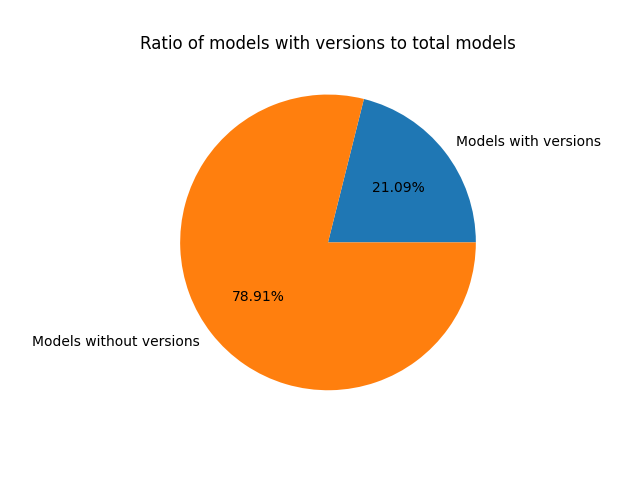

# Are Datascientists Embracing DevOps Principles for Model Versioning?

## Auteurs

Nous sommes quatre étudiants en dernière année à Polytech Nice-Sophia spécialisés en Architecture Logicielle (AL) :

- _Badr AL ACHKAR_

- _Nadim BEN AISSA_

- _Sourour GAZZEH_

- _Imene YAHIAOUI_

## I. Contexte

L'évolution constante des principes de DevOps vers le domaine de l'apprentissage automatique soulève la question cruciale de l'adoption de ces principes par les data scientists pour le versionnement des modèles. Cette intersection entre ingénierie logicielle et apprentissage automatique constitue une zone d'intérêt particulier, motivée par notre quête de comprendre comment ces deux domaines interconnectés convergent.

Notre motivation derrière cette étude réside dans la volonté de démystifier les pratiques actuelles du versionnement des modèles par les data scientists. Comprendre comment ces professionnels gèrent les différentes versions de leurs modèles revêt une importance capitale dans un contexte où l'apprentissage automatique s'insère de plus en plus dans des pipelines de développement logiciel.

- ### Outils de Versionnement Identifiés :

Dans cette recherche, deux outils majeurs ont capté notre attention : MLflow et Hugging Face. MLflow, au centre de l'écosystème DevOps pour le machine learning, propose une approche intégrée du cycle de vie des modèles. En parallèle, Hugging Face, en tant que plateforme publique, offre une alternative en mettant à disposition des modèles issus de grandes entreprises.

#### 1. Exploration de MLflow : 

MLflow révolutionne la gestion des modèles d'apprentissage automatique
en unifiant le processus du développement à la production. La première
phase de notre enquête se concentre sur la manière dont MLflow gère les
versions des modèles.

- **Comment MLflow stocke les modèles ? Comment sont-ils enregistrés, organisés et récupérés ?**

Pour répondre à ces questions cruciales, nous avons consulté la documentation officielle de MLflow et nous nous sommes appuyés sur les résultats validés par plusieurs articles scientifiques, dont les références sont soigneusement documentées dans notre bibliographie.

MLflow enregistre les modèles sous forme d'artefacts, utilisant divers
formats appelés "flavors", qui correspondent à différents formats
spécifiques de bibliothèques de machine learning, tels que TensorFlow,
PyTorch, Scikit-Learn. Ces modèles sont organisés dans un "registre"
structuré, chacun possédant un nom unique, des versions, des étapes de
transition (telles que développement, production, archivage) et
d'autres métadonnées.

La gestion des versions en Mlflow est automatisée, où chaque modèle
enregistré peut avoir une ou plusieurs versions. Lorsqu'un nouveau
modèle est ajouté au registre des modèles, il est enregistré en tant que
version 1. Chaque nouvel enregistrement sous le même nom incrémente
automatiquement le numéro de version.

Il est possible d'adapter manuellement cette gestion de versions à
travers l'utilisation d'alias, de tags et de descriptions :

- Les alias permettent de pointer vers une version spécifique du
  modèle, facilitant ainsi le référencement via l'URI
  models:/<model-name>@<alias>. Ils offrent une référence
  mutable et nommée à des versions spécifiques, simplifiant leur
  déploiement.

- Les tags permettent de catégoriser les modèles selon leur fonction
  ou statut.

- Les annotations et descriptions en Markdown fournissent des
  informations cruciales telles que des descriptions de version, des
  ensembles de données utilisés, etc.

Cependant, au cours de notre exploration des modèles et du processus de versionnement, nous avons constaté que MLflow est principalement adopté par des entreprises, et aucune d'entre elles ne rend publics leurs modèles, entravant ainsi notre accès à des projets et modèles versionnés pour une analyse approfondie.

#### 2. Exploration de Hugging Face :

Hugging Face est une plateforme spécialisée dans le partage et la découverte de modèles d'apprentissage automatique. Elle offre une vitrine publique où des data scientists du monde entier et des grandes entreprises importantes telles que Meta et Google. peuvent partager leurs modèles avec la communauté. Cela crée un écosystème ouvert où des modèles développés par des entreprises notables comme Facebook et Google sont accessibles à tous.

Dans le contexte de notre recherche, nous avons approfondi notre exploration pour comprendre comment les versions des modèles sont nommés et gérés sur Hugging Face. D'après la documentation officielle sur hugging face, les data scientists qui contribuent à la plateforme bénéficient d'une flexibilité significative dans le processus de nommage de leurs modèles et leurs versions, offrant ainsi une identification claire et facile de chaque modèle et sa version partagée.

Enfin, la particularité de Hugging Face réside dans sa transparence et son accessibilité. Les modèles sont généralement rendus publics, permettant à chacun de les explorer, les utiliser et les évaluer. Ainsi, après considération, nous avons opté pour Hugging Face comme plateforme principale pour notre recherche.

## II. Question général
L'objectif fondamental de notre projet de recherche est d'explorer l'adoption des principes DevOps par les data scientists pour le versionnement des modèles.

Ces réflexions nous conduiront à explorer les questions sous-jacentes suivantes :

1.  **_Est ce que les modèles publiés sur Hugging Face adoptent un
    schéma de versionnement traditionnel ou part plutôt sur le
    versionnement libre ?_**

2.  **_Le type de tâches (image-to-text, reinforcement, etc.)
    influence-t-il le schéma de versionnement ?_**

3.  **_Existe-t-il des tendances de versionnement spécifiques dans les grandes entreprises utilisant Hugging Face?_**

## III. Collecte de Données : Méthodes et Outils

Pour répondre de manière approfondie aux interrogations formulées, nous avons entrepris une exploration minutieuse du dépôt open source de Hugging Face, une riche source regroupant plus de 500 000 modèles partagés par une multitude d'utilisateurs et de grandes entreprises. Nous avons amorcé notre démarche par une analyse manuelle des modèles présents dans ce référentiel, initiant ainsi une approche qualitative essentielle pour appréhender la diversité des tâches et des méthodologies de versionnement.

Dans une volonté d'élargir notre échantillon de manière significative et de systématiser notre processus, nous avons opté pour le web scraping. Cette technique a permis la collecte efficace d'un nombre substantiel de modèles, alimentant ainsi nos différentes expériences. L'utilisation de Python, avec une focalisation sur la bibliothèque BeautifulSoup pour l'analyse HTML et requests pour les requêtes HTTP, a facilité l'extraction systématique des données nécessaires.
Cette transition stratégique de l'analyse manuelle vers l'automatisation au moyen du web scraping a grandement renforcé notre capacité à examiner un éventail plus large de modèles, établissant ainsi une base plus robuste pour nos diverses expérimentations. Pendant la phase de web scraping, nous avons décidé de cibler spécifiquement les modèles avec des tags associés à des catégories, représentant ainsi l'objectif du modèle avec sa catégorie. Cette approche sélective a permis d'obtenir des informations pertinentes, compte tenu du volume considérable de modèles sur Hugging Face.

Parallèlement, nous avons veillé à écarter toute redondance dans les modèles téléchargés, assurant ainsi l'intégrité de notre échantillon. En fin de compte, notre effort a abouti à la constitution d'une base de données solide, comprenant environ 230 000 modèles, qui servira de fondement pour répondre de manière approfondie aux diverses questions formulées dans le cadre de notre recherche.

## IV. Hypothèses, Expériences & Analyse des résultats

1. **_Adoption du Versionnement Traditionnel vs Versionnement Libre des
    Modèles_**

**1.1. _Hypothèse : Le versionnement des modèles ne suit pas une
approche traditionnel - (major,minor,patch)_**

L'observation des modèles sur Hugging Face suggère que la numérotation des versions des modèles ne suit pas un motif prévisible, contrairement à la structure classique de versionnement. Il semble y avoir une variation dans la manière dont les versions sont étiquetées. Cette variation dans l'étiquetage des versions suscite la question suivante : Est-ce que les modèles publiés sur Hugging Face adoptent un schéma de versionnement traditionnel ou part plutôt sur le versionnement libre ?

**1.2. _Expérience : Extraction d'un échantillon important des modèles
versionnées et poussé sur Hugging Face, et calcule de l'adoption
du versionnement traditionnel_**

Dans une première étape, nous avons utilisé une approche de web scraping plutôt naïve pour extraire les noms des modèles. Cette méthode a été mise en œuvre à l'aide de la bibliothèque Python BeautifulSoup, laquelle est conçue pour effectuer l'analyse syntaxique de documents HTML et XML.
Nous avons ensuite calculé le ratio des modèles qui contiennent un format de versionning sémantique (vX, vX.X, vX-X, vX.X.X, etc).

**1.3. _Résultat :_**

Cette premiere expérience nous a permis de confirmer notre hypothèse, avec un ratio de 79% des modèles qui ne suivent pas le versionnement traditionnel.

2.  **_Influence de la tâche du modèle sur son versionnement_**

  **2.1. _Hypothèse :  La nature de la tâche du modèle influence la  façon avec laquelle on le versionne_**

Nous émettons l'hypothèse selon laquelle la nature de la catégorie d'un modèle influence de manière significative sa méthodologie de versionnement. Cette hypothèse suggère que des caractéristiques propres à chaque catégorie de modèle peuvent exercer une influence sur les choix de versionnement adoptés.

  **2.2. _Expériences realisées_ :**

a. _Expérience 1 :_

Dans le cadre de notre étude sur l'influence de la tâche des modèles sur leur versionnement, notre démarche s'articule autour de plusieurs étapes. Tout d'abord, nous entamons notre investigation avec du web scraping afin d'extraire les tags, représentant des catégories associées aux modèles. Ces tags constituent la première couche de classification, permettant une organisation thématique des modèles.

Une fois les tags récupérés, notre approche se dirige vers le téléchargement des modèles associés à chaque catégorie. Pour chaque balise identifiée, le code extrait les noms des modèles et les enregistre dans des fichiers texte distincts. Ce processus nous permet de quantifier le nombre total de modèles dans chaque catégorie, offrant ainsi une première vue d'ensemble de la distribution des modèles sur la plateforme. Par la suite, nous reproduisons notre démarche de la première expérience pour identifier les modèles suivant des pratiques de versionnement standard par catégories.

Enfin, des graphiques en dispersion sont générés, illustrant l'adoption du versionnement sémantique par catégorie de modèles. Ces graphiques prennent en compte le nombre de modèles par catégorie et le pourcentage d'adoption du versionnement sémantique, afin d'explorer les tendances et les motifs récurrents dans les pratiques de versionnement, mettant ainsi en lumière l'influence potentielle de la tâche des modèles sur ces choix.

b. **_Résultat et analyse de l'expérience 1 :_**

Les résultats graphiques ont clairement démontré que le pourcentage d'adoption du versionnement sémantique varie considérablement d'une catégorie de modèle à une autre :

Cette observation souligne une corrélation directe entre la nature spécifique de la tâche d'un modèle et les choix de versionnement qui lui sont associés. Les différentes catégories de modèles présentent des tendances distinctes en matière de versionnement, révélant une diversité d'approches au sein de la plateforme.  Notre jeu de données est constitué de 42 catégories, et selon le schéma, certaines sont plus volumineuses que d'autres. Quelques catégories massives se distinguent par un taux d'adoption du versionnement sémantique élevé, principalement "Reinforcement Learning" et "Automatic Speech Recognition", Ces catégories spécifiques semblent favoriser l'utilisation d'un modèle de gestion des versions sémantique. En revanche, le reste des catégories affiche majoritairement un taux d'adoption inférieur à 20%.

En effet, "Reinforcement Learning" implique des modèles qui apprennent par interaction avec leur environnement, prenant des décisions pour maximiser une récompense cumulative. Cette dynamique d'apprentissage continu et d'évolution constante peut expliquer pourquoi cette catégorie privilégie un versionnement sémantique, offrant une manière plus claire de gérer les évolutions complexes de ces modèles. D'autre part, "Automatic Speech Recognition" concerne la technologie de reconnaissance automatique de la parole. Les modèles dans cette catégorie traitent des données audio et sont souvent soumis à des améliorations continues pour mieux comprendre et interpréter la parole humaine. Un modèle de versionnement sémantique pourrait être particulièrement avantageux pour suivre ces évolutions fréquentes et importantes dans le domaine de la reconnaissance vocale.

La question se pose alors de savoir si ce modèle de versionnement sémantique est bien adapté aux autres catégories, incitant ainsi à l'adoption d'un modèle de gestion des versions sémantique différent. 

c. **_Expérience 2 :_**

Dans cette deuxième expérience, notre objectif est de déterminer s'il existe une variation dans l'adoption du versionnement sémantique entre différentes catégories de modèles.
Pour ce faire, nous allons examiner les noms de modèles dans les ensembles de données les plus importants, représentant 80% du total, en nous basant sur la loi de Pareto, à l'exception de ceux relevant de "Automatic Speech Recognition" et "Reinforcement Learning", comme expliqué précédemment. 
Les catégories prises en compte sont : "text classification", "text generation", "text to text generation", "token classification", "text to image", et "fill-mask". 

Dans cette démarche, nous avons développé un script pour analyser les schémas de versionnement des modèles par catégorie de tâches. Ce script repose sur des choix méthodologiques délibérés pour atteindre notre objectif.

Initialement, le script simplifie les noms de modèles complexes, souvent composés de plusieurs termes séparés par des tirets ou des points. Nous avons choisi de considérer uniquement le premier terme de ces noms, en supposant que les segments suivants fonctionnent principalement comme des indicateurs de version. Cette approche, tout en simplifiant les noms, est justifiée par le fait que les noms multi-termes sont généralement uniques et peu fréquents. Ainsi, en se concentrant sur le premier terme, notre analyse reste centrée sur les éléments les plus représentatifs de l'ensemble de données.

Un aspect crucial de notre méthodologie est l'exclusion des modèles qui n'apparaissent qu'une seule fois dans l'ensemble de données. L'hypothèse sous-jacente est que les modèles uniques ont moins de chances d'avoir fait l'objet de versionnement, limitant ainsi notre capacité à comprendre l'évolution des noms de versions.

Également, notre script exclut spécifiquement les indicateurs numériques. Cette décision repose sur la reconnaissance que les identifiants numériques sont courants dans les pratiques de versionnement sémantique du développement logiciel. Puisque notre intérêt réside dans l'exploration de schémas de versionnement moins conventionnels et plus nuancés, les indicateurs numériques sont considérés comme moins informatifs à cette fin. L'exclusion de ces indicateurs est donc une décision stratégique visant à concentrer notre analyse sur la découverte de schémas de versionnement plus uniques et perspicaces.

d. **_Résultat et analyse de l'expérience 2 :_**

Les résultats montrent que chaque type de modèle a des tokens spécifiques du versionnement :

Les résultats suggèrent que chaque type de modèle possède des tokens spécifiques qui lui sont associés. Cependant, il est remarquable que quelques modèles partagent un token commun, tels que "base," "BERT," et "finetuned."

D'après des recherches préliminaires, l'utilisation fréquente du token "base" suggère qu'il pourrait représenter un "base model," indiquant ainsi un modèle fondamental ou de base, souvent utilisé comme point de départ pour des itérations ultérieures. Pour "BERT," acronyme de "Bidirectional Encoder Representations from Transformers," représentant un modèle de langage pré-entraîné utilisant une architecture de transformer bidirectionnelle, le terme "base" pourrait également signaler son rôle de modèle fondamental. Par ailleurs, le terme "finetuned" fait référence au processus de ré-entraînement d'un modèle linguistique pré-entraîné sur un ensemble de données spécifique à une tâche particulière, permettant au modèle de s'ajuster précisément à la spécificité de la tâche visée.

Dans le contexte de la classification de texte, d'autres tokens tels que "classification" et "classifier" sont couramment utilisés, probablement pour indiquer la nature de la tâche que le modèle est destiné à accomplir.

En ce qui concerne la génération de texte, d'autres tokens prédominants incluent "7b" et "13b" qui indiquent respectivement des modèles avec 7 milliards et 13 milliards de paramètres, soulignant la taille croissante et la complexité de ces modèles de génération de texte. "text-generation." Également, nous avons "GPTQ," qui représente une variante particulière du modèle GPT (Generative Pre-trained Transformer).

e. **_Expérience 3 :_**

Dans le cadre de notre démarche continue pour comprendre les schémas de versionnement, la troisième expérience vise à approfondir les résultats de l'expérience précédente en combinant les groupes de tokens constituant une version (2 ou 3 tokens). Cette approche nous permet d'analyser avec plus de détails les combinaisons les plus fréquemment observées, et d'évaluer si des tendances significatives se dégagent.

f. **_Résultat et analyse de l'expérience 3:_**

- **Les Groupes de Taille Deux :** L'analyse des groupes de deux tokens révèle deux types de regroupements : Catégories Conceptuelles et Séquences Numériques. Ces regroupements sont parfois combinés, suggérant que le versionnement pourrait s'opérer sur plusieurs dimensions ou aspects. Les catégories conceptuelles pourraient représenter différents types de changements ou de mises à jour, tandis que les séquences numériques pourraient indiquer des changements plus quantifiables, tels que des numéros de version ou des mises à jour incrémentielles de la taille de l'entrée, des poids, ou d'autres composants techniques.

- **Les Groupes de Taille Trois et Plus :** Ces regroupements accentuent davantage notre observation précédente, montrant des progressions sémantiques variées dans les tokens de versionnement, souvent combinées. Cette constatation suggère l'existence d'un système de versionnement plus complexe, où plusieurs aspects ou dimensions sont mis à jour simultanément.

Ces résultats, issus d'analyses approfondies, offrent un aperçu plus détaillé des schémas de versionnement. Au-delà de simples indicateurs numériques, les combinaisons de tokens révèlent des informations substantielles sur les types de changements opérés lors du versionnement, contribuant ainsi à une compréhension plus fine des pratiques de gestion des versions dans divers contextes.

**2.3. _Conclusion :_**

En conclusion, il est possible d'affirmer qu'aucun modèle de versionnement n'est unanimement adopté et accepté dans aucune catégorie. De nombreux schémas de versionnement sont détectés, mais leur occurrence est très infime pour être considérée comme une norme.

3.  **_Tendances de Versionnement dans les Grandes Entreprises_**

  3.1. **_Hypothèse : Les grandes entreprises standardise leurs manière > de versionner les modèles ML en interne_**

Nous formulons l'hypothèse que les grandes entreprises ont tendance à standardiser leur approche de versionnement pour les modèles d'apprentissage automatique en interne. Cette hypothèse suggère que, au sein de ces grandes structures, il existe probablement des pratiques et des normes établies vis-à-vis du processus de gestion des versions des modèles d'apprentissage automatique.

  3.2. **_Expérience : Analyse des modèles ceux publié par Google, > OpenAI et Meta, individuellement, et extraction des patterns > adoptée._**

Au cours de cette étude, nous avons spécifiquement sélectionné les entreprises les plus renommées du secteur. Dans cette perspective, notre recherche se concentrera exclusivement sur les artefacts de modèles publiés par Google, Facebook/Meta, et OpenAI, en tenant compte de la variabilité du nombre de modèles. Google a mis à disposition 617 artefacts, Facebook/Meta en a partagé 1879, et OpenAI en compte 32. Notre approche pour cette expérience suivra le même protocole que celui de l'expérience 2, visant à identifier les tokens les plus fréquemment utilisés.

  3.3 **_Résultat :_**

L'analyse des données obtenues a révélé ce qui suit : 

Nous observons l'identification de tokens spécifiques aux modèles tels que "medium," "large," "base," "small," ou "base." Cependant, aucune tendance claire de versionnement n'a été repérée à l'échelle globale de l'entreprise.

## V. Conclusion

En résumé, notre analyse révèle une grande diversité au sein de la communauté des data scientists en ce qui concerne l'implémentation du versionnement des modèles. Plutôt que de suivre un processus défini, il est fréquent d'observer une approche individualisée, laissant chacun libre de déterminer ses propres méthodes en fonction de ses besoins spécifiques. Cette liberté opérationnelle, bien que reflétant la nature adaptable de la science des données, entraîne souvent une non-conformité marquée aux normes établies par DevOps.
## Références

