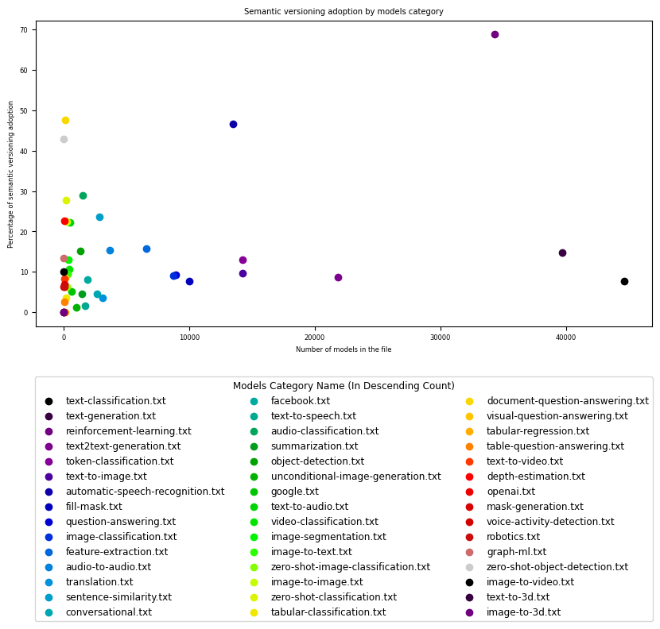

# Are Datascientists embracing DevOps principles for Model versioning?

## Auteurs

Nous sommes quatre étudiants en dernière année à Polytech Nice-Sophia spécialisés en Architecture Logicielle (AL) :
- Badr AL ACHKAR <<badr.al-achkar@etu.univ-cotedazur.fr>>
- Nadim BEN AISSA <<nadim.ben-aissa@etu.univ-cotedazur.fr>>
- Sourour GAZZEH <<sourour.gazzeh@etu.univ-cotedazur.fr>>
- Imene YAHIAOUI <<imene.yahiaoui@etu.univ-cotedazur.fr>>

## I. Contexte

L'évolution des sciences de la donnée, accompagnées par une intégration progressive des principes DevOps au sein de cette communauté, soulève des questionnements pertinents quant aux méthodologies adoptées pour le versionnement des artefacts, particulièrement les modèles. Notre motivation derrière cette étude réside dans la volonté de démystifier les pratiques actuelles du versionnement des modèles par les data scientists. Comprendre comment ces professionnels gèrent les différentes versions de leurs modèles revêt une importance capitale dans un contexte où l'apprentissage automatique s'insère de plus en plus dans des pipelines de développement logiciel.

Pour mener à bien cette investigation, notre recherche s'intéresse tout d'abord à Mlflow en tant que plateforme open-source, conçue pour aider les praticiens de l'apprentissage automatique à gérer le cycle de vie de leurs modèles d'apprentissage automatique, de l'exploration à la publication du modèle. Etant donné que Mlflow est destiné à un usage professionnel où les modèles sont gardés privés sans accès à une source interne, il ne fournit qu'un regard extérieur sur la façon à laquelle un outil de versionnement pour les data scientists pourrait ressembler, et la conduite de notre recherche se tourne vers Hugging Face, en tant que plateforme publique massive, où les modèles de différents contributeurs sont publiquement disponibles, en particulier ceux des grandes entreprises.

#### 1. Exploration de MLflow : 

MLflow est conçu pour la gestion des cycles de vie des modèles d'apprentissage automatique facilitant l'intégration et la standardisation du processus allant du développement jusqu'à la mise en production. Un aspect crucial de cette boucle est la gestion des versions des modèles. La première phase de notre enquête se concentre sur l'investigation de la manière dont MLflow gère les versions des modèles.
- **Comment MLflow stocke les modèles ? Comment sont-ils enregistrés, organisés et récupérés ?**

Afin d'adresser ces questionnements, notre investigation s'est appuyée sur une consultation de la documentation officielle de MLflow. Cette démarche a été enrichie par l'examen de multiples publications académiques, lesquelles ont permis de corroborer les résultats et les méthodologies proposées par MLflow.

Il semble que MLflow stocke comme artefacts les modèles résultant d'un entrainement, et utilise différents formats appelés "flavors". Ces formats sont basés sur le choix des bibliothèques d'apprentissage automatique sous-jacentes utilisées pour créer le modèle, telles que TensorFlow, PyTorch, Scikit-Learn.... Ils définissent comment charger et servir l'artefact de manière intuitive avec l'API de Mlflow.

Pour garder une trace de ces artefacts, les modèles MLflow sont organisés dans un registre structuré, chacun avec un nom unique, des versions, des étapes de transition (comme le développement, la production, l'archivage) et d'autres métadonnées.

En ce qui concerne la pratique du versionnage, la gestion des versions dans MLflow est automatisée et standardisée par défaut : lorsqu'un modèle est poussé dans le registre, le premier enregistrement est marqué comme v1, et chaque nouvel enregistrement sous le même nom incrémente automatiquement le numéro de version.

Si l'utilisateur souhaite employer sa propre approche de la version, Mlflow offre d'autres moyens d'attacher une version à un modèleà travers l'utilisation d'alias, de tags et de descriptions :

- Les **_alias_** permettent de pointer vers une version spécifique du modèle, facilitant ainsi le référencement via l'URI **models:/<model-name>@<alias>**. Ils offrent une référence mutable et nommée à des versions spécifiques, simplifiant leur déploiement.
- Les **_tags_** permettent de catégoriser les modèles selon leur fonction ou statut.
- Les **_annotations_** et **_descriptions_** fournissent les descriptions de version, les ensembles de données utilisés, etc.

#### 2. Exploration de Hugging Face :

Hugging Face se positionne comme une plateforme clé pour le partage et la découverte de modèles d'apprentissage automatique. Elle constitue une plateforme de choix pour des data scientists et des grandes entreprises telles que Meta et Google, qui y partagent leurs travaux avec la communauté internationale. À la date de rédaction de cet article, le 1er février 2024, Hugging Face héberge 490,621 modèles, accessibles publiquement, ce qui a joué un rôle déterminant dans le choix de cette plateforme pour notre recherche.

Dans le contexte de notre recherche, où nous nous concentrons sur la façon dont les modèles sont versionnés, Hugging face se positionne comme une plateforme qui offre aux data scientists une grande flexibilité dans les noms des artefacts qu'ils poussent, leur permettant de pousser les versions des modèles sans respecter un pattern particulier. Il est donc très intéressant pour nous de mener notre étude en s'appuyant sur ce hub.

## II. Question général

L'objectif fondamental de notre projet de recherche est d'explorer l'adoption des principes DevOps par les data scientists pour le versionnement des modèles.

Voici les questions sous-jacentes qui en découlent :

1.  **_Est ce que les modèles publiés sur Hugging Face adoptent un schéma de versionnement traditionnel ou part plutôt sur le versionnement libre ?_**

2.  **_Le type de tâches (image-to-text, reinforcement, etc.) influence-t-il le schéma de versionnement ?_**

3.  **_Existe-t-il des tendances de versionnement spécifiques dans les grandes entreprises utilisant Hugging Face?_**

## III. Collecte de Données : méthodes et outils

Notre recherche a adopté une approche sélective, en se concentrant uniquement sur les modèles avec des tags qui représentent la tâche du modèle dans Hugging Face. 

Le raisonnement derrière cela est qu'un modèle qui a été poussé vers ce hub public avec un tag aura probablement plus d'une apparition dans le hub. 

L'éditeur peut être en train de travailler sur cette tâche et à chaque fois il poussera de nouvelles versions de son modèle amélioré : avoir un but donne un avenir. 

Cette stratégie ciblée s'est avérée efficace pour extraire les modèles les plus significatifs, compte tenu de la diversité des modèles disponibles sur la plateforme Hugging Face. En outre, nous avons veillé à éviter les doublons, afin de garantir la validité et la fiabilité de notre échantillon.

Pour réaliser cela, nous nous sommes appuyés sur le web scraping en exploitant le langage de programmation Python et en utilisant à des librairies telles que BeautifulSoup pour analyser le HTML et les requests pour traiter les requêtes HTTP. Cette approche a conduit à la création d'une base de données riche, comprenant quelque 230 000 modèles, qui constitue une ressource adéquate et pertinente pour répondre aux questions de notre étude de recherche.

## IV. Hypothèses, Expériences & Analyse des résultats

1. **_Adoption du versionnement traditionnel vs versionnement libre des modèles_**

**1.1. _Hypothèse : Le versionnement des modèles ne suit pas une approche traditionnel - (major,minor,patch)_**

L'analyse des modèles sur Hugging Face révèle une particularité des schémas de versionnement, qui semble s'écarter des schémas classiques. Typiquement, le versionnement conventionnel suit un modèle sémantique structuré, basé sur trois niveaux de changement : majeur, mineur et correctif, indiqués respectivement par des chiffres dans le format version ``majeure.minor.patch``.  

Néanmoins, notre observation des modèles sur Hugging Face a révélé la récurrence de séquences diverses, telles que GPTQ, AWQ, 7b, 13b, small, medium, large, base, et d'autres encore.
Ces constatations indiquent un écart potentiel par rapport au cadre de versionnement traditionnel. Cette observation soulève une interrogation cruciale pour notre recherche : les modèles sur Hugging Face suivent-ils un schéma de versionnement traditionnel ou adoptent-ils plutôt une approche de versionnement plus libre et moins structurée ? 

**1.2. _Expérience : Calcul de l'adoption du versionnement traditionnel_**

Dans cette expérience, notre objectif principal était d'examiner de près les noms des modèles car ils contiennent des indications de version. 

Nous avons créé un script qui passe en revue les noms des modèles, vérifie l'existence d'une version sémantique traditionnelle et incrémente le nombre de correspondances avec une version sémantique.

Notre principal objectif était de déterminer le pourcentage de modèles utilisant une approche de versionnement sémantique parmi ceux que nous avons analysés dans notre échantillon de données.

Les résultats obtenus ont été représentés graphiquement sous la forme d'un diagramme circulaire, offrant ainsi une perspective visuelle sur la fréquence des modèles présentant un versionnement sémantique par rapport à ceux ne manifestant pas de versionnement apparent.

**1.3. _Résultat :_**

Le graphique ci-dessous présente les résultats de l'expérience, illustrant le pourcentage d'adoption du versionnement sémantique :

Cette première expérience a validé notre hypothèse, démontrant qu'environ 79% des modèles ne se conforment pas au modèle de versionnement traditionnel.

Cependant, il est essentiel de souligner qu'au sein de ces modèles, environ 21% (soit environ 41 000 modèles) semblent explorer des tentatives de versionnement sémantique. Ce nombre important souligne l'intérêt marqué de certains data scientists à établir une structure plus claire et compréhensible pour leurs modèles. Cette observation met en évidence la diversité des pratiques de versionnement au sein de la communauté des data scientists, reflétant peut-être des besoins spécifiques liés à la nature expérimentale de certains projets ou à des préférences individuelles ou peut-être même le manque de maturité de l'adoption des pratiques devops.

Ces variations dans les schémas de versionnement peuvent être en partie expliquées par la flexibilité offerte par les plateformes de partage de modèles, telles que Hugging Face, qui permettent aux data scientists de définir leurs propres conventions de versionnement.

2.  **_Influence de la tâche du modèle sur son versionnement_**

  **2.1. _Hypothèse :  La nature de la tâche du modèle influence la  façon avec laquelle on le versionne_**

Nous émettons l'hypothèse selon laquelle la nature de la tâche d'un modèle influence de manière significative la façon avec laquelle on le versionne. Cette hypothèse suggère que des caractéristiques propres à chaque catégorie de modèle peuvent exercer une influence sur les choix de versionnement adoptés.

  **2.2. _Expériences realisées_ :**

Dans le cadre de notre étude sur l'influence de la tâche des modèles sur leur versionnement, nous avons procédé en deux phases distinctes. La première phase visait à déterminer les catégories de tâches pour lesquelles les modèles optent pour un versionnement sémantique. Dans la seconde phase, nous avons examiné l'éventuelle présence de schémas de versionnement libre.

a. **_Etape 1 : Analyse du versionnement des modèles par type de tâche_**

Au cours de cette phase, nous nous sommes concentrés sur les modèles ayant adopté les pratiques de versionnement sémantique identifiées dans la première expérience. Ces modèles ont été ensuite regroupés par catégories, permettant ainsi la création d'un graphique reflétant à la fois le nombre de modèles par catégorie et le pourcentage d'adoption du versionnement sémantique pour chacun d'entre eux.

- **_Résultat_**

Les résultats graphiques ont clairement démontré que le pourcentage d'adoption du versionnement sémantique varie considérablement d'une catégorie de modèle à une autre :

- **_Analyse des résultats_**

Le graphique montre une corrélation directe entre la nature spécifique de la tâche d'un modèle et les choix de versionnement qui lui sont associés. Les différentes catégories de modèles présentent des tendances distinctes en matière de versionnement, révélant une diversité d'approches au sein de la plateforme. Parmi les 42 catégories identifiées, certaines se distinguent en regroupant un nombre de modèles nettement plus élevé que les autres.

Dans ces catégories, on observe un taux d'adoption élevé du versionnement sémantique dans le domaine de l'apprentissage par renforcement ("Reinforcement Learning") avec un pourcentage de **68.80 %**, et dans le domaine de la reconnaissance automatique de la parole ("Automatic Speech Recognition") avec un pourcentage de **46.55 %**. Ces domaines spécifiques montrent une tendance à privilégier un pattern de gestion des versions sémantique. À l'opposé, la majorité des autres catégories présente principalement un taux d'adoption du versionnement sémantique inférieur à 20 %.

En effet, le domaine du **"Reinforcement Learning"** se caractérise par des modèles d'apprentissage automatique qui interagissent dynamiquement avec leur environnement. Dans ce contexte, les modèles de "Reinforcement Learning" se distinguent par leur capacité à évoluer et à s'adapter à des situations changeantes, nécessitant ainsi des ajustements fréquents pour maintenir des performances optimales. 

D'autre part, **"Automatic Speech Recognition" (ASR)** s'agit d'une technologie dédiée à la reconnaissance automatique de la parole. Les modèles inclus dans cette catégorie sont spécifiquement conçus pour traiter des données audio, cherchant à interpréter et comprendre la parole humaine de manière automatisée. Il parait que dans ce domaine, les modèles ASR sont continuellement soumis à des améliorations afin d'affiner leur capacité à comprendre de manière précise les variations de la parole humaine. 

Ainsi, il semble logique d'adopter un versionnement sémantique dans ces deux catégories afin d'aboutir à une approche structurée pour gérer les modifications et les mises à jour fréquentes nécessaires à l'amélioration continue des modèles. Cela facilite le maintien d'une traçabilité transparente des évolutions successives dans ces domaines en constante évolution.

b. **_Etape 2 : Exploration des schémas libres pour les catégories de modèles_**

L'objectif de cette deuxième étape est de déterminer si chaque catégorie des modèles adopte un patterns spécifiques qui lui sont propres. Pour ce faire, nous avons exclu les deux catégories "Automatic Speech Recognition" et "Reinforcement Learning", qui présentent un niveau d'adoption du versionnement sémantique important. 

Nous avons concentré notre analyse sur les catégories restantes et l'avons limitée à celles qui contribuent avec le plus grand nombre de modèles, environ 80%. Les catégories prises en compte sont : "text classification", "text generation", "text to text generation", "token classification", "text to image", et "fill-mask".

Nous avons développé un script dédié pour analyser les stratégies de versionnement adoptées par les modèles en fonction de leur catégorie d'application. 

Le script aborde en premier lieu la complexité des noms de modèles, qui sont fréquemment constitués de plusieurs éléments (tokens), séparés soit par des tirets soit par des points. Nous avons identifié que les noms des modèles comprennent à la fois le nom du modèle et sa version, et observé que le premier token représente invariablement le nom du modèle. Nous avons donc extrait la composante correspondant au token de version, situé immédiatement après le nom du modèle. Dans ce cas, si les tokens suivants s'avèrent être des éléments intrinsèques du nom du modèle, ils seront alors assimilés fautivement à la version. Il se peut que certains tokens soient marginalement considérés comme des tokens de version alors qu'ils ne le sont pas, mais cela n'introduira pas de biais significatif à l'échelle globale.

Nous avons exclu les modèles identifiés uniquement une fois dans notre échantillon. Nous partons du principe que ces occurrences uniques sont moins susceptibles de refléter des pratiques de versionnement systématiques, ce qui réduit notre capacité à tracer l'évolution des conventions de nommage des versions.

En outre, les symboles numériques ont été délibérément exclus de notre analyse. Cette décision est basée sur le fait que de tels identifiants numériques sont utilisés dans les méthodes de versionnage conventionnelles, qui ne sont pas l'objet de l'analyse ici. Notre objectif d'identifier des pratiques de versionnement plus atypiques et nuancées nous amène à considérer les identifiants numériques comme étant de moindre intérêt dans ce contexte.

- **_Résultat :_**

- **_Analyse des résultats_**

Les résultats suggèrent que chaque catégorie de modèles possède des tokens spécifiques qui sont reocccurents. Suite à des recherches approfondies dans la documentation concernant les méthodes et les techniques de chaque catégorie, nous avons identifié un lien entre la tâche et les tokens utilisés dans le versionnement de ses modèles.

Analysons maintenant chaque tâche, ses tokens et leurs significations pour bien comprendre la stratégie de versionnement.

- Pour la tâche **_text-classification_**, les tokens les plus utilisés sont :
    - **Base** : ce terme pourrait faire référence à un modèle initial qui n'a pas subi de modifications spécifiques pour la tâche en question. Il s'agit d'un point de départ simple sans ajustements particuliers, utilisé comme référence ou base pour des modèles plus spécialisés.
    - **Finetuned** : Appliqué au processus d'ajustement d'un modèle pré-entraîné sur des données spécifiques à la tâche de text-classification. Cela signifie que le modèle a été adapté pour mieux répondre aux caractéristiques de la classification de texte, améliorant ainsi ses performances sur cette tâche spécifique.
    - **BERT** : (Bidirectional Encoder Representations from Transformers) est une architecture de réseau de neurones transformer révolutionnaire pour le traitement du langage naturel. En text-classification, BERT peut servir de modèle pré-entraîné pour capturer les relations contextuelles entre les mots dans un texte, améliorant ainsi les performances de la classification.
    - **RoBERTa** : Une variante de BERT utilisée de manière similaire en text-classification. Elle élimine certaines composantes de BERT pour des performances optimisées sur des tâches spécifiques, comme la classification de texte.
    - **Classifier / Classification** : Ces termes sont directement liés à la text-classification. Un "classifier" ou un modèle de "classification" est spécifiquement conçu pour attribuer des catégories ou des étiquettes à des documents textuels en fonction de leur contenu.
    - **Sentiment** : En text-classification, la détection de sentiment est courante. Le terme "sentiment" est associé à des modèles conçus pour classer des documents textuels en fonction de l'émotion exprimée.
  
  Nous remarquons que les tokens de version sont présents dans la version pour indiquer la réutilisation d'un certain composant et/ou le progrès dans un aspect particulier de la tâche.

- Pour la tâche **_text-to-text-generation_** les tokens les plus utilisés sont :
    - **Large / Small** : Spécifier "Large" ou "Small" en text-to-text generation permet d'ajuster la taille du modèle en fonction des contraintes de ressources, d'optimiser la complexité du texte généré et de répondre spécifiquement aux besoins de chaque tâche.
    - **T5** : (Text-to-Text Transfer Transformer), une architecture qui unifie différentes tâches en présentant du texte en entrée et en formant le modèle à générer un texte cible.
    - **Base** : Peut désigner la version de base du modèle T5.
    - **Bart** : (Bidirectional and Auto-Regressive Transformers), un autre modèle de traitement du langage naturel conçu pour des tâches de génération de texte.

  De même, nous remarquons que les tokens de version indiquent l'utilisation d'un composant ou d'une architecture particulière, mais aussi, cette fois, sa taille.

- Pour tâche **_text-generation_** les tokens les plus utilisés sont :
    - **GPTQ** (Accurate Post-Training Quantization) : Une méthode de quantification post-entraînement (PTQ) pour la quantification à 4 bits qui se concentre principalement sur l'inférence et les performances sur GPU, visant à réduire la taille des modèles LLM(Large Language Models).
    - **7B** et  **13B** : Indiquent respectivement des modèles avec 7 milliards et 13 milliards de paramètres, soulignant la taille croissante et la complexité des modèles de génération de texte.
    - **GGUF** :  Une méthode de quantification qui permet aux utilisateurs d'utiliser le CPU pour exécuter un modèle de langage volumineux (LLM) tout en déchargeant certaines de ses couches vers le GPU pour accélérer le processus.
    - **AWQ** (Quantification de Poids Consciente de l'Activation) : Une technique de quantification de poids consciente de l'activation utilisée pour la compression et l'accélération des modèles, qui suppose que tous les poids ne sont pas également importants pour les performances d'un modèle de langage volumineux (LLM).
    - **LLMA** (Large Language Model Meta AI) : Un grand modèle linguistique développé par Meta, servant de fondation à plusieurs applications, dont des agents conversationnels.
    - **Chat** : Un token associé aux conversations sur les chats lors de la génération de textes.

  Ici, les tokens communiquent de manière évidente le nombre de paramètres du modèle et le format d'emballage choisi.

- Pour la tâche **_token-classification_**, les tokens les plus fréquents et distingués étaient :
    - **Ner** : (Named Entity Recognition) Fait référence à la reconnaissance d'entités nommées, une tâche où le modèle identifie et catégorise des entités telles que  les noms de personnes, les lieux et les organisations dans un texte.
    - **Cased / Uncased** : Indique si le modèle prend en compte la casse (Cased) ou l'ignore (Uncased) lors de la reconnaissance des tokens.

  Les tokens de version dans ce cas sont assez simples, ils dénotent une sémantique dans la tâche qui est prise en compte par le modèle versionné.

- Pour la tâche **_text-to-images_**, les tokens les plus utilisés sont :
    - **Lora** : (Low-Rank Adaptation of Large Language Models) Une technique légère de text-to-image qui réduit considérablement le nombre de paramètres entraînables dans un modèle.
    - **Diffusion** : Définit une méthode de génération d'images basée sur une chaîne de diffusion de pas, ajoutant progressivement du bruit aléatoire aux données et apprenant à inverser le processus pour construire des échantillons de données souhaités à partir du bruit.
    - **SDXL** (Stable Diffusion XL) : Une technique améliorant la génération de texte vers image, adoptant une approche en deux étapes avec un modèle de base générant une image et un modèle raffineur ajoutant des détails supplémentaires de haute qualité dans une étape distincte.
    - **Dreambooth** : Une technique d'entraînement mettant à jour l'ensemble du modèle en s'entraînant sur quelques images d'un sujet ou d'un style spécifique.
    - **Style** : Peut indiquer le style de l'image associé au texte lors de la génération d'image.

  Cette fois-ci, il s'agit de choix technologiques rattachés à la version elle-même.

- Pour la tâche **_fill-mask_** :
  - Plusieurs tokens ont été mis en œuvre et ont déjà 
    été expliqués à travers 
    les autres tâches qui les utilisent, tels que **Base**, **Bert**, 
    **Finetuned**, **Cased / Uncased**, **Small / Large**.
  - En effet, **_fill-mask_** fait référence à un type spécifique de modèle NLP 
   capable de remplir les espaces réservés (masques) dans une phrase ou un texte, souvent basé sur des réseaux de neurones, en particulier les transformers. Cela explique l'usage de ces tokens dans le contexte de fill-mask où le modèle est entraîné pour compléter les parties manquantes dans un texte donné.

En conclusion, il semble que les data scientists communiquent les fonctionnalités, le comportement et d'autres aspects des modèles par le biais de leurs versions. Cela varie naturellement d'une tâche à l'autre, ce qui rend la catégorie du modèle très importante dans ce sens.
  
c. **_Manipulation des données : Exploration des groupes de tokens_**

Pour approfondir notre compréhension des schémas de versionnement, il a été jugé pertinent d'explorer l'existence de combinaisons spécifiques de tokens qui manifestent une récurrence significative à travers différentes versions de modèles.

Cette étude a commencé par l'identification de combinaisons potentielles de tokens entre les modèles, suivie d'un recensement des occurrences de ces groupes de tokens partagés. Par la suite, nous avons procédé à l'identification des groupes de tokens communs aux différents modèles pour chaque tâche spécifique, en enregistrant les occurrences et les modèles correspondants. 

En utilisant ces données, nous avons créé des graphiques à barres empilées pour obtenir une représentation visuelle des groupes de tokens les plus fréquemment observés.

- **_Résultat_**

- **_Analyse des résultats_**

    - **Analyse des paires de tokens :** L'exploration des combinaisons de deux tokens révèle deux types catégories prédominants.
      Dans un premier temps, nous avons identifié des catégories conceptuelles qui cherchent à ajuster les techniques spécifiques du modèle et à optimiser ses paramètres. La juxtaposition fréquente de "awq" et "gptq" pour la génération de texte illustre deux méthodes de quantification des modèles LLM souvent exploitées pour investiguer les différentes versions et améliorer leurs modèles. En ce qui concerne la classification de texte, la plupart des tokens incluent le terme "base", associé à d'autres tels que "bert", "finetuned", "roberta" ou "sentiment", traduisant ainsi l'évolution des modèles de leur version de base vers des modèles intégrant des techniques plus avancées. En outre, d'autres combinaisons comprenant "base", "large" ou "small" suggèrent une transition de la taille du modèle, passant d'une version de base à une version plus petite ou plus grande.
      En ce qui concerne les catégories numériques, la combinaison dominante identifiée est "13b 7b" pour la génération de texte, indiquant une variation du nombre de paramètres à travers les différentes versions du modèle, avec pour objectif une progression et une amélioration continues.
      Parfois, des combinaisons entre catégories numériques et conceptuelles se manifestent, laissant entrevoir que le versionnement pourrait opérer sur plusieurs dimensions ou aspects. Cette diversité dans les combinaisons suggère une exploration continue des opportunités offertes par ces configurations variées.

    - **Analyse des combinaisons de trois tokens et plus :** Ces regroupements renforcent notre constat initial, mettant en exergue des progressions sémantiques diversifiées au sein des tokens de versionnement, souvent conjuguées. Cette observation suggère l'existence d'un système de versionnement plus complexe, où plusieurs aspects ou dimensions sont mis à jour simultanément.

**2.3. _Conclusion :_**

En conclusion, il est possible d'affirmer qu'aucun modèle de versionnement n'est unanimement adopté et accepté dans aucune catégorie. De nombreux schémas de versionnement sont détectés, mais leur occurrence est très infime pour être considérée comme une norme.

3.  **_Tendances de versionnement dans les grandes entreprises_**

  **3.1. _Hypothèse : Les grandes entreprises standardise leurs manières de versionner les modèles ML en interne_**

Nous formulons l'hypothèse que les grandes entreprises ont tendance à standardiser leur approche de versionnement pour les modèles d'apprentissage automatique en interne. Cette hypothèse suggère que, au sein de ces grandes structures, il existe probablement des pratiques et des normes établies vis-à-vis du processus de gestion des versions des modèles d'apprentissage automatique.

  **3.2. _Expérience : Analyse des modèles ceux publié par Google, OpenAI et Meta, individuellement, et extraction des patterns adoptés._**

Au cours de cette étude, nous avons spécifiquement sélectionné les entreprises les plus renommées du secteur. Dans cette perspective, notre recherche se concentrera exclusivement sur les artefacts de modèles publiés par Google, Facebook/Meta, et OpenAI, en tenant compte de la variabilité du nombre de modèles. Google a mis à disposition 617 modèles, Facebook/Meta en a partagé 1879, et OpenAI en compte 32. Notre approche pour cette expérience suivra le même protocole que celui de l'expérience 2, visant à identifier les tokens les plus fréquemment utilisés.

  **3.3 _Résultat :_**

L'analyse des données obtenues a révélé ce qui suit : 

Nous observons l'identification de tokens spécifiques liés à la nature des modèles tels que "medium", "large", "base", "small", ou "base". Cependant, aucune tendance claire de versionnement n'a été repérée à l'échelle globale de l'entreprise.

**4. _Limites trouvées_**
   
Les expériences menées ont suscité notre intérêt pour examiner l'historique des téléchargements des différentes versions, dans le but d'obtenir des informations significatives sur la pertinence et l'adoption des versions antérieures. Ceci aurait permis d'identifier si les utilisateurs préfèrent les versions récentes ou s'ils continuent d'utiliser les anciennes.

Toutefois, la plateforme Hugging Face n'inclut pas les détails de téléchargement des modèles. Cette contrainte a limité notre capacité à analyser en profondeur les tendances de versionnement et les préférences d'utilisation.

## V. Conclusion

En résumé, notre analyse révèle une grande diversité au sein de la communauté des data scientists en ce qui concerne l'implémentation du versionnement des modèles. Plutôt que de suivre un processus défini, il est fréquent d'observer une approche individualisée, laissant chacun libre de déterminer ses propres méthodes en fonction de ses besoins spécifiques. Cette liberté opérationnelle, bien que reflétant la nature adaptable de la science des données, entraîne souvent une non-conformité marquée aux normes établies par DevOps.

## Références
#### MLflow :
- Documentation officielle de MLflow : https://mlflow.org/docs/latest/index.html
- Chen, A., Chow, A., Davidson, A., DCunha, A., Ghodsi, A., Hong, S. A., ... & Zumar, C.
(2020, June). Developments in mlflow: A system to accelerate the machine learning lifecycle. In
Proceedings of the fourth international workshop on data management for end-to-end machine
learning (pp. 1-4)
- Lauchande, N. (2021). Machine Learning Engineering with MLflow: Manage the End-to-end
Machine Learning Life Cycle with MLflow. United Kingdom: Packt Publishing.
- Zaharia, M., Chen, A., Davidson, A., Ghodsi, A., Hong, S. A., Konwinski, A., ... & Zumar, C.
(2018). Accelerating the machine learning lifecycle with MLflow. IEEE Data Eng. Bull., 41(4),
39-45.
  
#### HuggingFace :
- Documentation officielle de HuggingFace :  https://huggingface.co/docs
- Wolf, Thomas, et al. "Huggingface's transformers: State-of-the-art natural language processing." arXiv preprint arXiv:1910.03771 (2019).

#### Les modèles de machines learning :
- Bert : [https://www.demotal.fr/bert-le-modele-de-langue-de-reference-pour-les-taches-de-nlp](https://www.demotal.fr/bert-le-modele-de-langue-de-reference-pour-les-taches-de-nlp/#:~:text=BERT%2C%20qui%20est%20l'acronyme,la%20fois%20bidirectionnel%20et%20contextuel.)
- GPTQ Accurate Post-Training Quantization : https://arxiv.org/pdf/2210.17323.pdf
- GPTQ vs. GGUF vs. AWQ : https://maartengrootendorst.substack.com/p/which-quantization-method-is-right
- Dreambooth : https://www.dreambooth.fr/
- Automatic Speech Recognition : [https://www.demotal.fr/bert-le-modele-de-langue-de-reference-pour-les-taches-de-nlp](https://www.demotal.fr/bert-le-modele-de-langue-de-reference-pour-les-taches-de-nlp/#:~:text=BERT%2C%20qui%20est%20l'acronyme,la%20fois%20bidirectionnel%20et%20contextuel)

